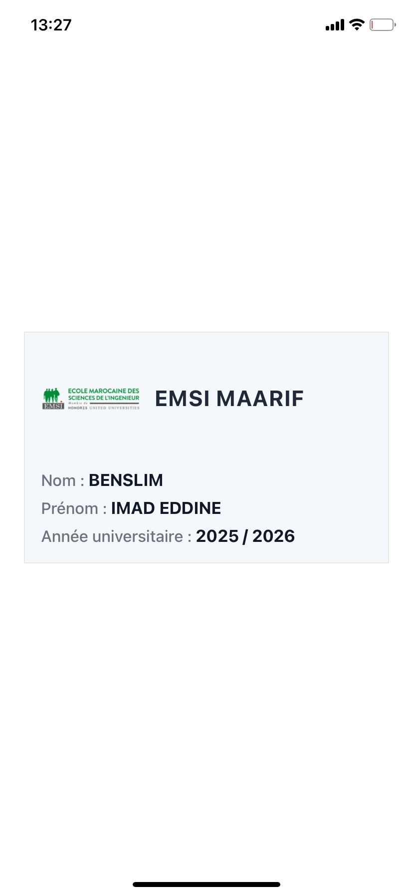

# Carte Étudiante EMSI — React Native

Une application simple réalisée dans le cadre du **TP1 en React Native**, affichant une carte étudiante avec le **logo de L'École Marocaine des Sciences de l'Ingénieur**, le **nom du campus**, ainsi que les **informations de l’étudiant** (Nom, Prénom, Année universitaire).

  

